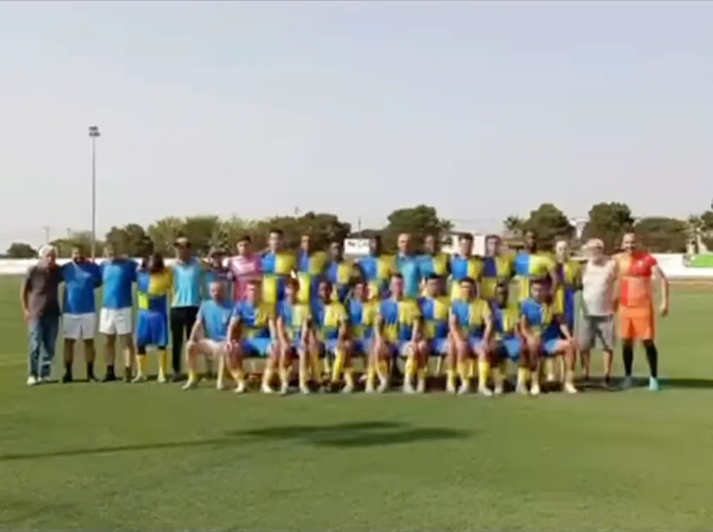

O Sport Clube Desportos de Glória do Ribatejo apresentou no Campo dos Carvalhos a equipa sénior e os escalões de formação para a nova temporada, numa iniciativa que juntou atletas, treinadores, famílias e adeptos.

Além do plantel sénior, subiram ao relvado os Infantis, os Benjamins, os Petizes e os Traquinas — os quatro escalões que o clube apresenta como o seu futuro.

A jornada encerrou com o jogo de apresentação da equipa sénior, frente à AREPA. Na publicação em que deu conta do dia, o clube não indicou o resultado final, sublinhando antes a entrega e a união demonstradas dentro e fora das quatro linhas.

A direção agradeceu ainda a presença de atletas, treinadores, famílias, sócios e adeptos, repetindo o lema do clube: «Um clube. Uma família. Uma coroa. Um sonho.»
